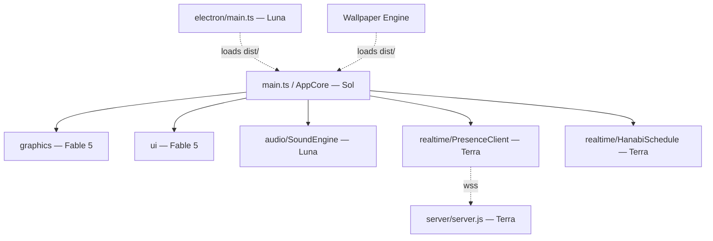
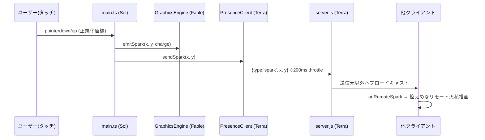

# 『花火と心模様』(Hanabi Canvas) Design

## Overview

Vite + TypeScript のシングルページアプリを核に、graphics（Three.js）/ audio（Web Audio API）/ realtime（WebSocket）/ ui の4モジュールを `main.ts` がオーケストレーションする。各モジュールは本書の**インターフェース契約**のみを介して結合し、担当者（Fable 5 / GPT-5.6 Sol・Terra・Luna）が独立に並行実装できる。デスクトップは同一の dist/ を Electron と Wallpaper Engine が包む多段配布構成。

## Architecture

### Components

| モジュール | パス | 担当 | 責務 |
|---|---|---|---|
| **GraphicsEngine** | `src/graphics/` | Fable 5 | 【確定: Canvas2D実装】「花火と橋 デザイン案」Turn 2 (2a) 常駐シーンの移植。1440x810 固定シーン空間＋cover ブリット。橋デッキ前景・常駐三輪（瞬き/金糸/呼吸/パルス）・タップ火花・水面反射。当初の Three.js/UnrealBloomPass 案はデザイン確定により置換（加算合成 'lighter' とスプライトグラデーションで発光を表現） |
| **UI** | `src/ui/` | Fable 5 | 半透明ミニマルUI、ムード切替、気配トグル、カウントダウンウィジェット、長押しチャージ表示 |
| **SoundEngine** | `src/audio/SoundEngine.ts` | Luna | 環境音マルチトラックループ、ローパスフィルタ、イージング音量 |
| **PresenceClient** | `src/realtime/PresenceClient.ts` | Terra | WS接続・再接続、座標送信（スロットリング）、気配受信イベント |
| **HanabiSchedule** | `src/realtime/HanabiSchedule.ts` | Terra | 花火日程JSON読込・カウントダウン計算 |
| **AppCore** | `src/main.ts` | Sol | 全エンジン初期化・イベント配線・ライフサイクル・PWA |
| **DesktopShell** | `electron/main.ts` | Luna | 透過フレームレスウィンドウ・トレイ常駐・マルチディスプレイ |
| **PresenceServer** | `server/server.js` | Terra | ws Pub/Sub 中継（DB・識別なし） |

### Module Dependency



依存方向は常に `main.ts → 各モジュール`。モジュール同士は直接参照せず、main.ts のイベント配線を経由する。

### Data Flow（気配の往復）



## Interface Contracts（担当間の結合境界 — 変更時は全担当合意必須）

### 1. WebSocket プロトコル（Terra server ⇔ Terra client）

```typescript
// クライアント→サーバー / サーバー→他クライアント（同形をそのまま中継）
interface SparkMessage {
  type: 'spark';
  x: number;   // 0.0–1.0: 横長ベースイラストの「シーン座標系」で正規化
  y: number;   // 0.0–1.0（同上）
}
// サーバーは JSON.parse 失敗・type不一致のメッセージを黙って破棄する
```

**座標系の定義（Fable/Terra 合意事項）**: x, y はウィンドウ座標ではなく、**横長ベースイラスト全体を (0,0)–(1,1) とするシーン座標系**で正規化する。cover表示・縦アセット表示でトリミングされた領域差を吸収し、全端末で火花が同じ「場所」に着弾する。スクリーン⇔シーンの変換は GraphicsEngine が提供し（`toSceneCoords(clientX, clientY)`）、PresenceClient は変換済みの値のみを扱う。受信座標が自端末の表示範囲外の場合、GraphicsEngine は最寄りの表示端にクランプして控えめに表示する。

### 2. モジュール公開API（main.ts が呼ぶ面）

```typescript
type MoodId = 'sparkle' | 'quiet';

interface MoodProfile {
  id: MoodId;
  bloomStrength: number;      // sparkle: 1.8 / quiet: 0.8
  colorGrade: 'sunset-navy' | 'cyan-darknavy';
  particleSpeed: number;      // 粒子の元気さ係数
  lowpassFreq: number | null; // quiet時のカットオフHz / sparkle時は null(バイパス)
}
// 所有権: MoodProfile の定義値は src/moods.ts（Fable 管理）が単一ソース。
// ただし音響系フィールド（lowpassFreq）の具体値は Luna が決定・更新権を持ち、
// moods.ts への反映は Luna の提案値を採用する（現行値: quiet = 1200Hz）。
// ムード遷移時間は共有定数 MOOD_TRANSITION_MS = 1200 （src/types.ts）を graphics / audio で共用する。
// colorGrade はキーであり、グレーディングの実数値（lift/gain/彩度/bloom radius・threshold）は
// graphics 内部のプリセット表（GraphicsMoodPreset）が保持する — MoodProfile 契約は変更しない。
//   sunset-navy:    彩度1.12 / bloom radius 0.55 / threshold 0.72（≒sRGB 223）
//   cyan-darknavy:  彩度0.86 / bloom radius 0.80 / threshold 0.55（≒sRGB 197）
//   ※ Quiet は強度を下げつつ閾値も下げ「光る対象を増やす」ことで輝く静寂を表現する

// --- graphics (Fable 5) ---
interface GraphicsEngine {
  init(canvas: HTMLCanvasElement): Promise<void>;
  toSceneCoords(clientX: number, clientY: number): { x: number; y: number }; // 0–1 シーン座標へ変換
  setMood(profile: MoodProfile): void;
  emitSpark(x: number, y: number, charge: number): void; // charge: 0–1 長押し蓄積量
  emitRemoteSpark(x: number, y: number): void;           // リモートは控えめ演出
  beginCharge(x: number, y: number): void;               // 長押しチャージ表示開始
  endCharge(): number;                                   // 蓄積 charge を返す
  resize(w: number, h: number): void;
  dispose(): void;
}

// --- audio (Luna) ---
interface SoundEngine {
  init(): Promise<void>;      // 初回ユーザー操作後に呼ぶ（autoplay制約）
  setMood(profile: MoodProfile): void; // lowpassFreq と音量をイージング適用
  playSparkle(): void;        // 火花のパチパチ音ワンショット
  setMuted(muted: boolean): void;
  dispose(): void;
}

// --- realtime (Terra) ---
interface PresenceClient {
  connect(url: string): void;         // 自動再接続（指数バックオフ）内蔵
  sendSpark(x: number, y: number): void; // 内部で200msスロットリング
  onRemoteSpark(cb: (x: number, y: number) => void): void;
  setEnabled(enabled: boolean): void; // 気配トグル OFF で送受信停止
  dispose(): void;
}

interface HanabiSchedule {
  load(url: string): Promise<HanabiEvent[]>;
  nextEvent(now: Date): HanabiEvent | null;
  countdown(now: Date): { days: number; hours: number; minutes: number } | null;
}

// --- ui (Fable 5) ---
interface UIController {
  init(root: HTMLElement): void;
  onMoodChange(cb: (mood: MoodId) => void): void;
  onPresenceToggle(cb: (enabled: boolean) => void): void;
  updateCountdown(event: HanabiEvent | null, cd: {days: number; hours: number; minutes: number} | null): void;
}

interface IntroOverlay {  // FR-014: 静かな入口。紙質感＋線画花火＋サービス名の淡い表示
  show(root: HTMLElement): void;
  onEnter(cb: () => void): void;  // タップで発火。main.ts はここで SoundEngine.init → メイン遷移
  dismiss(): Promise<void>;       // 夜のキャンバスへのイージング遷移（完了で解決）
}
```

### 3. データモデル

```typescript
interface HanabiEvent {
  id: string;
  name: string;        // 例: "隅田川花火大会"
  prefecture: string;  // 例: "東京都"
  date: string;        // ISO 8601 (JST): "2026-07-25T19:00:00+09:00"
}
// 供給元: public/data/hanabi-schedule.json（HanabiEvent[] の静的JSON）

interface CanvasEmitter {
  id: string;
  x: number;           // シーン座標系 0–1
  y: number;
  kind: 'sparkler' | 'lantern' | 'streetlight' | 'star' | 'window';
  intensity: number;   // 0–1
}
// 供給元: public/assets/canvas-emitters.json — ベースイラスト内の高光度ポイント座標マップ。
// 輝度設計の原則: イラストPNG本体はLDR（最大 sRGB ≒ 200）に抑えて光源を焼き込まず、
// Bloom閾値を超える光はすべてコード側の加算スプライト（HalfFloatターゲット）で重畳する。
// パーティクル・加算合成は HalfFloat レンダーターゲット必須（UnsignedByteでは1.0クリップでBloomが破綻）
```

## PWA / 配布構成

- **Vite + vite-plugin-pwa**（Sol）: manifest（`display: 'standalone'`、縦横両対応）、Workbox precache で HTML/JS/イラスト/音源をオフラインキャッシュ。ビューポートは `100dvh` + `svh` フォールバックで100vh問題を吸収
- **Electron**（Luna）: `frame: false, transparent: true`、Tray常駐、`screen` APIでディスプレイごとにサイズ追従。dist/ を `loadFile` で読む（dev時は Vite dev server URL）
- **Wallpaper Engine**（Luna）: dist/ 直下に `project.json` を同梱するビルドスクリプト。相対パス参照のみ（`base: './'`）で追加ビルド不要に

## サーバー構成（Terra）

- `server/server.js`: Node.js + `ws` のみ。接続管理は `Set<WebSocket>`、受信 → バリデーション → 送信元以外へ `readyState === OPEN` のみブロードキャスト
- Nginx: `wss://<domain>/ws` → `proxy_pass http://localhost:8080`（Upgrade ヘッダ透過）、TLS終端
- 環境変数: `PORT`（デフォルト8080）のみ。DB・セッション・ログ永続化なし

## Error Handling

- **WS切断**: PresenceClient が指数バックオフ（1s→2s→…最大30s）で自動再接続。切断中もローカル体験は継続
- **不正メッセージ**: サーバー・クライアント双方で parse 失敗/型不一致は黙殺（例外を伝播させない）
- **音源ロード失敗**: 該当トラックのみ無音でスキップし、他トラックは再生継続
- **autoplay制約**: SoundEngine.init は初回 pointerdown まで遅延。AudioContext suspended 時は resume を試行
- **WebGL非対応/コンテキストロスト**: 静的イラスト＋CSSのみのフォールバック表示に切替

## Security Considerations

- 認証なし（匿名前提）だが、サーバーはメッセージ長上限（256バイト）・レート制限（クライアントあたり10msg/秒）で濫用を抑止
- x, y は数値かつ 0–1 範囲を検証してから中継（スクリプト注入面を持たない）
- CORS/Origin チェック: 本番ドメインからの接続のみ許可

## Testing Strategy

- **Unit**: HanabiSchedule のカウントダウン計算（境界: 開催中・終了直後・データ空・**全件終了済み** — 後2者は null を返す）、PresenceClient のスロットリング/再接続、MoodProfile 適用値
- **Integration**: server.js に複数WSクライアントを接続し「送信元以外へ転送」「不正メッセージ黙殺」「レート制限」を検証（node:test + ws）
- **E2E（Phase毎の手動検証）**: Phase 1 ブラウザで光と音の基本体験 / Phase 2 モバイル実機でPWA・タッチ・VPS経由の気配 / Phase 3 Electron ビルドと Wallpaper Engine 読込
